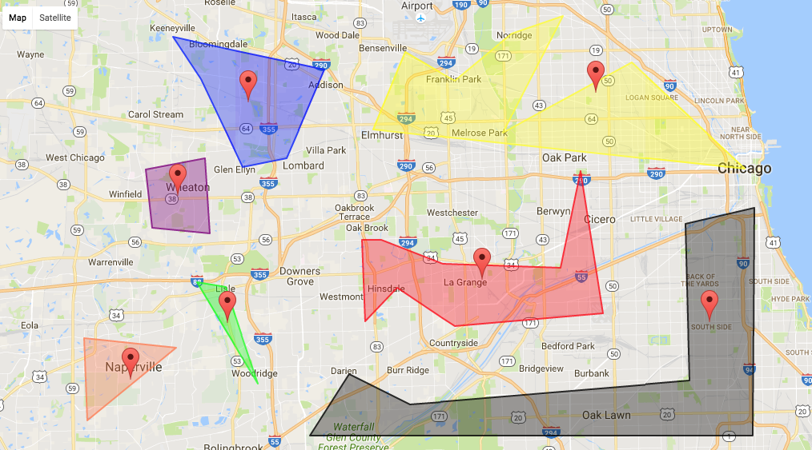

# Polygon Experiment

Experiments with placing a marker around the center of a polygon.

Find approximate center point of an arbitrary polygon on Google Maps.  Process:

* Add a `getBoundingBox` method to `google.maps.Polygon.prototype` which returns a LatLngBounds object (rectangle) that entirely contains an arbitrarily complex polygon
* Get the center of that bounding box
* If the center of the bounding box is within the area of the polygon, put the marker there
* If the center of the bounding box is not within the area of the polygon then:
	* Work out the height of the bounding box
	* Look at points North, East, South and West of the center at 5% increments of the total height and width of the bounding box
	* If any of those points is within the area of the polygon, place the marker there and stop looking

This may not be foolproof but should get a point within the polygon that's good enough.  As this moves up and down the bounding box looking for points within the polygon at 5% height increments, it could miss a very thin slice of the polygon that crosses the center line and never find a point... could fix this by using 1% increments and a 50 loop count for higher search "resolution" but lower performance.

## Notes

* You need to supply a Google Maps API key and set this in the link to the Google Maps API JavaScript in `index.html`
* Because we are using `google.maps.geometry` functions, the link to get the Google Maps API JavaSCript needs to include `&libraries=geometry` (see `index.html`)

## Other Ways of Doing This

There are other possible algorithms for getting similar results:

* MapBox has one [here](https://github.com/mapbox/polylabel/blob/master/index.js) with a supporting [blog post]		(https://www.mapbox.com/blog/polygon-center/)
* [Discussion on calculating centroid](http://mathcentral.uregina.ca/qq/database/qq.09.07/h/david7.html)
